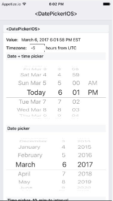

React Native
============

[TOC]


## Setup development environment

Estas instrucciones son para **instalar y configurar** el entorno de desarrollo en **linux**.
**En linux** no es posible construir la aplicación para iOS, **sólo para android.**
**Cualquier editor te texto sirve para desarrollar con RN**, no es necesario Android Studio.


### Pre-requisitos
- Node.js 4 o superor

### Android SDK
Estos son los paquetes **necesarios** a instalar en el sdk manager:

- Android SDK Platform-tools Rev. 23.0.1
- Android SDK Build-tools Rev. 23.0.1
- Android 6.0 (API 23)
  - SDK Platform
  - Google APIs
- Extras
  - Android Support Repository
  - Google Repository\*

\* Opcional, pero requerido por algunos modulos extras de RN.(Recomendado)


La guía oficial de RN instala **librerías extra** como las imágenes para la emulación de android en el **emulador de android studio**, pero sólo son necesarias si se hará uso de éste.

#### Variables de entorno ANDROID_HOME

La variable de entorno ANDROID_HOME es requerida por RN.
También es necesario agregar las herramientas de android sdk al PATH.

```bash
export ANDROID_HOME=${HOME}/Android/Sdk
export PATH=${PATH}:${ANDROID_HOME}/tools
export PATH=${PATH}:${ANDROID_HOME}/platform-tools
```

### Watchman
Opcional pero recomendado, acelera la construcción de la aplicación.

> You can use these steps below to get watchman built. You will need autoconf and automake. You may optionally build watchman without pcre and python support.

```bash
$ git clone https://github.com/facebook/watchman.git
$ cd watchman
$ git checkout v4.7.0  # the latest stable release
$ ./autogen.sh
$ ./configure
$ make
$ sudo make install
```
[Guía completa de instalación Watchman](https://facebook.github.io/watchman/docs/install.html)

#### Inotify Watchers

Será necesario [**aumentar la cantidad de *inotify watchers***](https://github.com/guard/listen/wiki/Increasing-the-amount-of-inotify-watchers)

Para Debian, Redhat o similar:

`$ echo fs.inotify.max_user_watches=524288 | sudo tee -a /etc/sysctl.conf && sudo sysctl -p`

Archlinux:

`$ echo fs.inotify.max_user_watches=524288 | sudo tee /etc/sysctl.d/40-max-user-watches.conf && sudo sysctl --system`

### Emulador o configuración de dispositivo

#### Dispositivo android

La mejor opción, por comodidad y eficiencia, es definitivamente un **dispositvo con android**.

En el dispositivo android el **modo desarrollador** y la **depuración USB** deben estar activados.

#### Emulador

El emulador de android studio tiende a ser muy lento, se recomienda la instalación de **[Genymotion](https://www.genymotion.com/fun-zone/)**.

Genymotion debe utilizar ADB del Android SDK,   deben modificarse las opciones.


### Instalación de RN CLI

Basta con instalarla desde NPM

`$ npm install -g react-native-cli`

Para iniciar un nuevo proyecto:

`$ react-native init NuevoProyecto`

*A partir de react-native-cli v1.2.0 instalará las dependencias mediante yarn.*

Al iniciar un nuevo proyecto se creará la siguiente estructura de directorios y archivos ademas de instalar las dependencias necesarias:


Los archivos **index.android.js** y **index.ios.js** son los *main* que se utilizarán para construir la aplicación para cada plataforma:


Package.json:


### Probar la instalación en el emulador o dispositivo

El emulador debe estar en ejecución, y en el caso del dispositivo debe estar conectado mediante USB.

Para verificar que hay dispositivos disponibles, se puede utilizar la herramienta `$ adb devices`


Para construir la aplicación e instalarla en el dispositivo:

`$ react-native run-android`

Si todo va bien, el dispositivo debe ejecutar la aplicación base de react native:


En la terminal debe estar ejecutándose el packager:


Algunas veces el packager crashea y es necesario iniciarlo nuevamente con `$ npm start`

## Desarrollando con React Native

### Funcionamiento de React Native

En React, el Virtual DOM actua como una capa entre la **descripción del desarrollador de como deberían verse las cosas**, y el procesamiento para renderizar la aplicación.

En el contexto Web, el Virtual Dom se ve primeramente como una optimización y sí que lo es; pero dado que **React "entiende" como debe verse la aplicación**, en lugar de renderizar al DOM del navegador, **React Native invoca APIs de Objective-C/Java para renderear componentes nativos** en iOS/Android.


**Los componentes de React retornan *markup*** de su función render, que describe como deben verse los componentes. En React Web esto se traduce directamente al DOM del navegador, y **en React Native se traduce para ajustarse a la plataforma adecuada, así un <View> se convierte en UIView de iOS**.

### Lifecyle

Es ciclo de vida de los componentes es **básicamente el mismo que React para Web**.


El procesamiento es distinto ya que **React Native depende del *bridge***, que se encarga de traducir javascript y hacer las llamadas correspondientes a la plataforma host para renderear los componentes.

### Creando componentes

Los componentes de React Native son mayormente como los de React, pero **existen algunas diferencias importantes para el renderizado y estilo.**

#### Views

En React para Web se renderizan componentes normales de HTML ( &lt;div&gt;, &lt;p&gt;,	&lt;span&gt;,&lt;a&gt;, etc.) estos elementos son **remplazados por componentes de React específicos para cada plataforma**. El componente **&lt;View&gt; es el componente mas básico multiplataforma** en React Native, es el análogo a &lt;div&gt;.

React Native provee de elementos básicos multiplataforma similares a los de Web:


Y también provee de elementos que son específicos para cada plataforma:



[Componentes Nativos iOS](http://facebook.github.io/react-native/releases/0.42/docs/native-components-ios.html#native-ui-components)
[Componentes Nativos Android](http://facebook.github.io/react-native/releases/0.42/docs/native-components-android.html#native-ui-components)

Dado que los elementos de la UI son componentes de React, es necesario importarlos explícitamente de React Native.

```javascript
import React, { Component } from 'react';
import {
  StyleSheet,
  Text,
  View
} from 'react-native';
```

Los componentes varian de plataforma a plataforma, por esto, **la manera en que se estrucutran los componentes es muy importante en RN**.

Si se planea reutilizar código en RN, mantener una separación entre este tipo de componentes es algo crítico. Por eso **es importante que los componentes de React encapsulen la lógica**, para que sea fácil asociar un componente con una vista de acuerdo a la plataforma.

#### Estilos

Al trabajar con React Native se utiliza  un estándar para el estilo que es **un subconjunto de CSS**, basado principalmente en flexbox para el diseño, y **se centra en la simplicidad en lugar de implementar la gama completa de reglas CSS**.

RN insiste en el uso de estilos *inline* trabajando con objetos en lugar de *stylesheets*:

```javascript
// Definimos un estilo...
var style = {
backgroundColor: 'white',
fontSize: '16px'
};
// ...y lo aplicamos.
var texto = (
<Text style={style}>
Texto con estilos
</Text>);
```

Esta aplicación ejemplo de React Native permite explorar los componentes y estilos soportador por RN:
[React Native UIExplorer](https://github.com/facebook/react-native/tree/master/Examples/UIExplorer)

#### APIs para cada plataforma

Las APIs para cada plataforma permiten que las aplicaciones tengan **una experiencia de usuario mucho mas natural**. Incluyen todo desde **almacenamiento de datos, servicios de ubicación, acceder al hardware como la cámara, etc.** conforme mas avanza el desarrollo de RN se crean mas y mas APIs.


### App Registry

AppRegistry es el componente de entrada para ejecutar una aplicación de React Native en cualquier plataforma.

```javascript
AppRegistry.registerComponent('ReactNative101', () => ReactNative101);

```

Para hacer cambios en el componente principal, tambien hay que modificar el MainActivity.java


### Estilos en RN

Como se menciona anteriormente, RN utilza estilos muy similares a los de CSS.
Para definir un estilo puede definirse un objeto de javascript o mediante el modulo StyleSheet y se asigna a la prop style del componente. Tambien es posible asignar un array de estilos, el último elemento tendrá prioridad, para permitir herencia de estilos.


```javascript
const styles = StyleSheet.create({
  bigblue: {
    color: 'blue',
    fontWeight: 'bold',
    fontSize: 30,
  },
  red: {
    color: 'red',
  },
});

class LotsOfStyles extends Component {
  render() {
    return (
      <View>
        <Text style={styles.red}>just red</Text>
        <Text childStyle={styles.red} style={styles.bigblue}>
			just bigblue
			<Text style={this.props.childStyle}> Red </Text>
		</Text>
        <Text style={[styles.bigblue, styles.red]}>bigblue, then red</Text>
        <Text style={[styles.red, styles.bigblue]}>red, then bigblue</Text>
      </View>
    );
  }
}
```

#### Flexbox

Con Flex es muy fácil hacer que las dimensiones de nuestros componentes se ajusten deacuerdo al espacio disponible.

La propiedad flex indica la proporción a utilizar del espacio en el que está contenido.

En el siguiente ejemplo, el contenedor del View es la ventana de la App(con las dimensiones de la pantalla) al tener `{flex :1}` al ser el único elemento su proporción es 1:1, y ocupa toda la altura de la pantalla.

Los siguientes tres Views hijos, tienen una proporción 1:6, 2:6 y 3:6, por lo que cada uno ajusta sus dimensiones respectivamente.

Cabe destacar que en RN por defecto el flexDirection es por defecto column y flex sólo soporta un solo número.

```javascript
import React, { Component } from 'react';
import { AppRegistry, View } from 'react-native';
class FlexDimensionsBasics extends Component {
  render() {
    return (
      // Try removing the `flex: 1` on the parent View.
      // The parent will not have dimensions, so the children can't expand.
      // What if you add `height: 300` instead of `flex: 1`?
      <View style={{flex: 1}}>
        <View style={{flex: 1, backgroundColor: 'powderblue'}} />
        <View style={{flex: 2, backgroundColor: 'skyblue'}} />
        <View style={{flex: 3, backgroundColor: 'steelblue'}} />
      </View>
    );
  }
}
AppRegistry.registerComponent('AwesomeProject', () => FlexDimensionsBasics);
```


flexDirection define el eje primario en el que los componentes hijos serán organizados, ya sea vertical(column) u horizontal(row).

justifyContent determina como serán distribuidos los elementos hijo, con respecto al eje primario, permitiendo acomodarlos al inicio del flexbox, al final, centrados, con espacios, etc. (flex-start, center, flex-end, space-around, y space-between)

alignItems también determina la distribución de los elementos hijo pero con respecto al eje secundario. (flex-start, center, flex-end, y stretch)

El siguiente ejemplo muestra 3 Views con dimensiones fijas contenidos en un View que los centra vertical y horizontalmente.

```javascript
import React, { Component } from 'react';
import { AppRegistry, View } from 'react-native';

class AlignItemsBasics extends Component {
  render() {
    return (
      // Try setting `alignItems` to 'flex-start'
      // Try setting `justifyContent` to `flex-end`.
      // Try setting `flexDirection` to `row`.
      <View style={{
        flex: 1,
        flexDirection: 'column',
        justifyContent: 'center',
        alignItems: 'center',
      }}>
        <View style={{width: 50, height: 50, backgroundColor: 'powderblue'}} />
        <View style={{width: 50, height: 50, backgroundColor: 'skyblue'}} />
        <View style={{width: 50, height: 50, backgroundColor: 'steelblue'}} />
      </View>
    );
  }
};


AppRegistry.registerComponent('AwesomeProject', () => AlignItemsBasics);
```


Flexbox es muy práctico de utilizar, sin embargo, conforme las versiones han cambiado algunas aplicaciones tienden a romperse debido a los cambios realizados en la implementación de flexbox.

[Propiedades completas del layout](https://facebook.github.io/react-native/docs/layout-props.html)

### Verificar conexión a internet

NetInfo es un modulo incluido en RN que nos permite saber el estado actual de la conexión a internet. Es posible integrar un listener en algun componente para saber de los cambios en la conexión a internet como en el siguiiente ejemplo:

```javascript
class IsConnected extends React.Component {
  state = {
    isConnected: null,
  };

  componentDidMount() {
    NetInfo.isConnected.addEventListener(
        'change',
        this._handleConnectivityChange
    );
    NetInfo.isConnected.fetch().done(
        (isConnected) => { this.setState({isConnected}); }
    );
  }

  componentWillUnmount() {
    NetInfo.isConnected.removeEventListener(
        'change',
        this._handleConnectivityChange
    );
  }

  _handleConnectivityChange = (isConnected) => {
    this.setState({
      isConnected,
    });
  };

  render() {
    return (
        <View>
          <Text>{this.state.isConnected ? 'Online' : 'Offline'}</Text>
        </View>
    );
  }

```

En Android es necesario agregar el permiso para acceder al estado de red del dispositivo en el archivo AndroidManifest.xml:

```xml
<uses-permission android:name="android.permission.ACCESS_NETWORK_STATE" /> Asynchronously determine if the device is connected and details about that connection.
```
También es posible determinar el tipo de conexión

```javascript
class ConnectionInfoCurrent extends React.Component {
  state = {
    connectionInfo: null,
  };

  componentDidMount() {
    NetInfo.addEventListener(
        'change',
        this._handleConnectionInfoChange
    );
    NetInfo.fetch().done(
        (connectionInfo) => { this.setState({connectionInfo}); }
    );
  }

  componentWillUnmount() {
    NetInfo.removeEventListener(
        'change',
        this._handleConnectionInfoChange
    );
  }

  _handleConnectionInfoChange = (connectionInfo) => {
    this.setState({
      connectionInfo,
    });
  };

  render() {
    return (
        <View>
          <Text>{this.state.connectionInfo}</Text>
        </View>
    );
  }
}
```

Tipos de conectividad en Android.

- **NONE:** device is offline
- **BLUETOOTH:** The Bluetooth data connection.
- **DUMMY:** Dummy data connection.
- **ETHERNET:** The Ethernet data connection.
- **MOBILE:** The Mobile data connection.
- **MOBILE_DUN:** A DUN-specific Mobile data connection.
- **MOBILE_HIPRI:** A High Priority Mobile data connection.
- **MOBILE_MMS:** An MMS-specific Mobile data connection.
- **MOBILE_SUPL:** A SUPL-specific Mobile data connection.
- **VPN:** A virtual network using one or more native bearers. Requires API Level 21
- **WIFI:** The WIFI data connection.
- **WIMAX:** The WiMAX data connection.
- **UNKNOWN:** Unknown data connection.


[Dcoumentación completa de NetInfo](https://facebook.github.io/react-native/docs/netinfo.html)

### Bluetooth

Existen algunas librerías externas para gestionar la conexión Bluetooth, la mas popular es [react-native-ble-manager](https://github.com/innoveit/react-native-ble-manager).

Se instala mediante npm y el ract native link se encargará de modificar los archivos correspondientes para cada plataforma para que el módulo esté disponible.

```shell
$ npm i --save react-native-ble-manager
$ react-native link
```


Los permisos de android pueden agregarse desde el AndroidManifest.xml o gestionarse con el modulo [PermissionAndroid](https://facebook.github.io/react-native/docs/permissionsandroid.html)

```xml
<manifest xmlns:android="http://schemas.android.com/apk/res/android"
    ...
    <uses-permission android:name="android.permission.BLUETOOTH"/>
    <uses-permission android:name="android.permission.BLUETOOTH_ADMIN"/>
    <uses-permission-sdk-23 android:name="android.permission.ACCESS_COARSE_LOCATION"/>

    <!-- Add this line if your application always requires BLE. More info can be found on:
         https://developer.android.com/guide/topics/connectivity/bluetooth-le.html#permissions
      -->
    <uses-feature android:name="android.hardware.bluetooth_le" android:required="true"/>

    <uses-sdk
        android:minSdkVersion="19"
        ...
```
Programaticamente
```javascript
if (Platform.OS === 'android' && Platform.Version >= 23) {
  PermissionsAndroid.checkPermission(PermissionsAndroid.PERMISSIONS.ACCESS_COARSE_LOCATION).then((result) => {
    if (result) {
      console.log("Permission is OK");
    } else {
      PermissionsAndroid.requestPermission(PermissionsAndroid.PERMISSIONS.ACCESS_COARSE_LOCATION).then((result) => {
        if (result) {
          console.log("User accept");
        } else {
          console.log("User refuse");
        }
      });
    }
  })
}
```
El ejemplo completo de uso de este módulo se encuentra en el repositorio.

Se inicia el módulo cuando se monta el componente:

```javascript
BleManager.start({showAlert: false})
  .then(() => {
    // Success code
    console.log('Module initialized');
  });

```

Se asigna un botón para activar el scaneo con la función scan de BLEManager, que recibe como parámetros un array de Strings con los UUIDs de los servicios a buscar, y un entero que es la cantidad de segundos a escanear:

```javascript
BleManager.scan([], 5)
  .then(() => {
    // Success code
    console.log('Scan started');
  });
```

Despuès de escanear los dispositivos, la conexión se realiza mediante Blemanager.connect que recibe como parámetro el UUID/Mac Address del dispositivo a conectarse:

```javascript
BleManager.connect('XX:XX:XX:XX:XX:XX:')
  .then((peripheralInfo) => {
    // Success code
    console.log('Connected');
    console.log(peripheralInfo);
  })
  .catch((error) => {
    // Failure code
    console.log(error);
  });
```

Para escribir en el dispositivo

```javascript
var base64 = require('base64-js');
var datosEnBase64 = base64.fromByteArray(Datos);

BleManager.write('UUID/MAC Dispositivo', 'UUID del servicio', 'UUID de la caràcterisca', datosEnBase64)
  .then(() => {
    // Success code
    console.log('Write: ' + datosEnBase64);
  })
  .catch((error) => {
    // Failure code
    console.log(error);
  });
```

Para lectura de datos:

```javascript
BleManager.read('UUID/MAC Dispositivo', 'UUID del servicio', 'UUID de la caràcterisca')
  .then((readData) => {
    // Success code
    console.log('Read: ' + readData);
  })
  .catch((error) => {
    // Failure code
    console.log(error);
  });
```

Otras funciones que incluye el módulo son:

- stopScan(): Detiene el escanéo de dispositivos
- disconnect(IdDispositivo): Desconecta el dispositivo indicado.
- enableBluetooth(): Crea una petición para que el usuario active el bluetooth del dispositivo
- getConnectedPeripherals(serviceUUIDs): Regresa todos los dispositivos conectados
- getDiscoveredPeripherals(): Regresa los dispositivos que se descubieron tras el escanéo
- isPeripheralConnected(peripheralId, serviceUUIDs): Verifica si un dispositivo está conectado, regresa true o false


Listeners de BLEManagaer(todos tienen el prefijo BleManager)
- StopScan: Se detuvo el escaneo
- DidUpdateState: Se cambió el estado de BLE (on/off)
- DiscoverPeripheral: Se encontró un nuevo dispositivo
- DidUpdateValueForCharacteristic: Una carácterística a notificado un nuevo valor
- ConnectPeripheral: Se ha conectado un dispositivo
- DisconnectPeripheral: Se ha desconectado un dispositvo


[Documentación completa de BLEManager](https://github.com/innoveit/react-native-ble-manager)

### Almacenamiento

#### AsyncStorage

El módulo AsyncStorage es el sistema de almacenamiento global llave-valor de React Native es el análogo a LocalStorage.


```javascript
try {
  await AsyncStorage.setItem('@MySuperStore:key', 'I like to save it.');
} catch (error) {
  // Error saving data
}

try {
  const value = await AsyncStorage.getItem('@MySuperStore:key');
  if (value !== null){
    // We have data!!
    console.log(value);
  }
} catch (error) {
  // Error retrieving data
}
```

RN **recomienda utilizar una abstracción por encima de la API** en lugar de hacer uso de esta directamente.

#### Redux y state persistente

Los siguientes módulos son requeridos(no esas versiones en específico) para configurar redux de manera persistente, con logger y thunk para hacer dispatch de funciones.


```javascript
import { applyMiddleware, compose, createStore } from 'redux'
import { autoRehydrate, persistStore } from 'redux-persist'
import { AsyncStorage } from 'react-native'
import CreateLogger from 'redux-logger'
import { Provider } from 'react-redux'
import React from 'react'
import Reducer from './reducers'
import thunkMiddleware from 'redux-thunk'

// Middleware logging actions in DEV mode
const loggerMiddleware = CreateLogger({ predicate: () => __DEV__ })

function configureStore (initialState) {
	const enhancer = compose(
		applyMiddleware(
			thunkMiddleware, // dispatch() functions
			loggerMiddleware,
		),
		autoRehydrate({ log: __DEV__ }),
	)
	return createStore(Reducer, initialState, enhancer)
}

export const store = configureStore({/*Initial state*/})

// If purge needed
// persistStore(store, { storage: AsyncStorage }).purge()
persistStore(store, { storage: AsyncStorage })

const App = () => {
	return (
		<Provider store={ store }>
			<MainView/>
		</Provider>
	)
}

export default App
```

Reducers/index.js:

```javascript
import * as fooReducers from './foos'
import * as barReducers from './bars'
import { combineReducers } from 'redux'

export default combineReducers(Object.assign(
	fooReducers,
	barReducers,
))
```

Reducers/foos.js:

```javascript
import * as types from '../actions/types'
import createReducer from '../lib/createReducer'

export const toggleTutorial = createReducer({}, {
	[types.TOGGLE_FOO] (state) {
		let newState = {
			...state,
			foo: !state.foo,
		}
		return newState
	},
})
```
lib/createReducer.js:
```javascript
export default function createReducer (initialState, handlers) {
	return function reducer (state = initialState, action) {
		if (handlers.hasOwnProperty(action.type))
			return handlers[action.type](state, action)
		else
			return state
	}
}
```

actions/index.js:

```javascript
import * as fooActions from './foos'
import * as barActions from './bar'

export const ActionCreators = Object.assign({},
  FooActions,
  BarActions
)
```

actions/types.js
```javascript
export const TOGGLE_FOO = 'TOGGLE_FOO'
export const TOGGLE_BAR = 'TOGGLE_BAR'
```

El software necesario es practicamente el mismo utilizado en React Web con la diferencia de hacer uso de AsyncStorage para el almacenamiento.

El redux-logger **sólo es visible cuando se debuggea la aplicación en chrome**.

### Material Design

Actualmente no existe ningun módulo que implemente tantos componentes como los que incluye Materialize CSS, sin embargo, existen algunos módulos que complementándose cubren varios componente útiles.

#### React Native Material UI

[Github Repo](https://github.com/xotahal/react-native-material-ui)

Una de las librerías mas completas, desafortunadamente su documentación todavía no está terminada.


**Componentes:**
- Action Button
- Avatar
- Badge
- Bottom Navigation
- Button
- Card
- Checkbox
- Dialog
- Divider
- Drawer
- Icon
- Icon toggles
- List item
- Radio button
- Subheader
- Toolbar

Tienen disponible una [Demo App](https://github.com/xotahal/react-native-material-ui-demo-app) para visualizar sus componentes.

#### React Native Material Kit

[Github Repo](https://github.com/xinthink/react-native-material-kit)

A pesar de tener muy pocos componentes, están muy bien realizados, y tienen buenas animaciones.


**Componentes:**
- Buttons
- Cards
- Loading
	- Progress bar
	- Spinner
- Sliders
	- Range Slider
- Textfields
- Toggles
	- Checkbox
	- Radio button
	- Icon toggle
	- Switch

#### React Native Material Design

[Github Repo](https://github.com/binggg/react-native-material-design-styles)

Este módulo incluye componentes para estilizar textos y provee de un componente con los colores de diseño de Material.

**Componentes:**
- Color
- Typography


